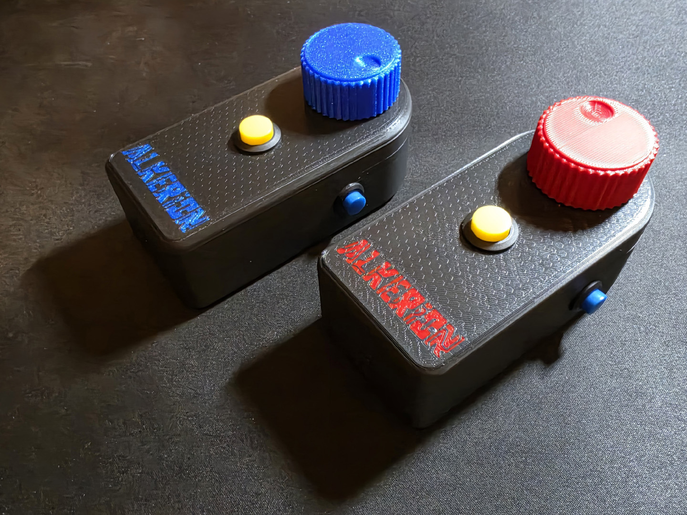
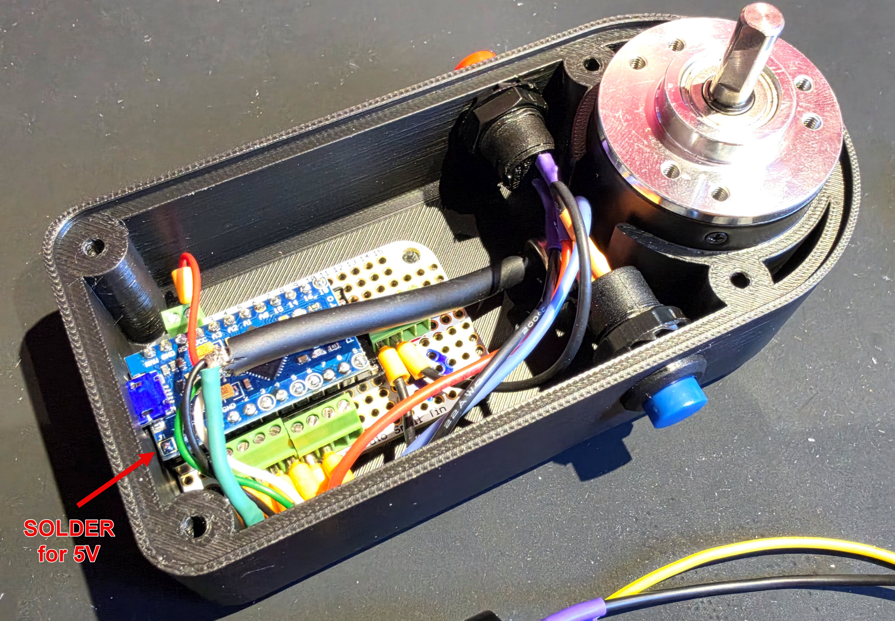

# Alkenoid Spinner

A USB arcade spinner for [Alkenoid](https://alkerion.itch.io/alkenoid) — the
knob you turn to move the paddle, like the original 1986 cabinet.

Firmware, 3D files and wiring. Two of them can be plugged in at once, one per
player.



## Why it is a gamepad and not a mouse

Most DIY spinners emulate a **mouse**. That is the right choice for an
emulator, and the wrong one here: Windows **merges every mouse into a single
cursor**. Two spinners would move the same pointer and the game could not tell
which one was turned — no two-player mode.

As a **gamepad**, each board is a separate device, seen individually by the
game, with no native code involved.

The price to pay: a gamepad axis is **absolute and bounded** (−32768 to
+32767) while a spinner turns forever. So the firmware sends a **counter that
wraps around**, and the game reads the **difference** between two frames. See
*Reading the axis* below — the wrap corrects itself.

## Bill of materials

| part | model | qty |
|---|---|---|
| Rotary encoder | 600 PPR optical, 6 mm shaft (C38S6G5-600B-G24N) | 1 |
| Microcontroller | Arduino Pro Micro, ATmega32U4, **5 V / 16 MHz** | 1 |
| Prototyping board | [Adafruit Perma-Proto, Small Mint Tin size](https://www.adafruit.com/product/1214) | 1 |
| Header socket | 2 × 12-pin female, so the board lifts out | 1 pair |
| Screw terminals | *optional* — 2.54 mm pitch, so nothing is soldered to the wires | 4 |
| Push buttons | momentary, panel mount — 2 × **12 mm** (DS-228) and 1 × **16 mm** (R13-507) | 3 |
| Knob | printed, see `3d/` | 1 |
| Enclosure | printed, see `3d/` | 1 |

The board **must have native USB**. An ATmega328P Pro Mini cannot work — it
has no USB controller and can never be a HID device.

The **hole diameters** are what matter for the printed enclosure: 12 mm for
the two side buttons, and **15.80 mm** for the one on top.

## Wiring

```
encoder A (white) -> pin 2      encoder GND -> GND
encoder B (green) -> pin 3      encoder VCC -> VCC (bridge J1 for 5 V)
cable shield      -> GND        (one end only, board side)
button 1          -> pin 4, other leg to ground
button 2          -> pin 5, same
button 3          -> pin 6, same
```



**Pins 2 and 3 are not a matter of taste**: they are the two external
interrupts, INT1 and INT0. An encoder is read on interrupt or it is not read
at all — polling loses counts on a fast flick, and the paddle drifts by that
much for good.

Buttons need **no external resistor**: `INPUT_PULLUP` uses the one inside the
microcontroller.

## Flashing

Arduino IDE or `arduino-cli`, board **SparkFun Pro Micro 16 MHz (5V)** — or
Arduino Leonardo, same chip and bootloader. One library:
[HID-Project](https://github.com/NicoHood/HID) by NicoHood.

Same firmware on both boards. Everything adjustable sits at the top of
`Spinner.ino`; the only value you may need to touch is `SENS`, which flips the
direction of rotation.

## The board package

`avr/boards.txt` declares two boards, **Alkenoid Spinner 1** and **Alkenoid
Spinner 2**. It is the only file of the platform that is mine — the rest
belongs to SparkFun, so install theirs and drop this file in.

Install the **SparkFun AVR core** first (Boards Manager, or
[Arduino_Boards](https://github.com/sparkfun/Arduino_Boards)). Then either:

- add the two entries from `avr/boards.txt` to the core's own `boards.txt`; or
- copy the whole SparkFun core folder to `<sketchbook>/hardware/Alkerion/avr/`
  and replace its `boards.txt` with this one.

Restart the IDE afterwards — the board list is only read at startup. The two
entries then appear under *Alkerion Boards*.

| | VID | sketch PID | name announced |
|---|---|---|---|
| Spinner 1 | 0x1B4F | 0x9206 | Alkenoid Spinner 1 |
| Spinner 2 | 0x1B4F | 0x9204 | Alkenoid Spinner 2 |

That is the whole point: Windows keys the controller name by VID/PID (see
*Two spinners*), so two boards need two PIDs to carry two names. Select the
matching entry before flashing each unit.

Four things learnt the hard way, and worth knowing before you edit any of it:

- **Do not invent a PID.** An undeclared value has nothing to bind to on the
  host. 0x9204 works because the SparkFun driver already declares it — it is
  the 3.3 V / 8 MHz variant's own PID.
- **`pid.0` stays 0x9205 in both entries.** That is the *bootloader* PID —
  separate firmware, already on the board. Compiling does not change it, and
  changing it here loses the upload port.
- **No `cpu` menu in these entries, on purpose.** A menu key **overrides** the
  general key: as long as one is present, `build.pid` is ignored in favour of
  `menu.cpu.….build.pid`. Removing the menu leaves one place where the PID is
  written, and it is the one that counts.
- **`variants/promicro` must be reachable.** Taking a board out of its
  original package breaks `build.variant`, and `pins_arduino.h` goes missing.
  Copy the folder in, or write `build.variant=sparkfun:promicro`. And beware —
  *it compiles* is not *it is right*: a wrong `pins_arduino.h` produces a valid
  binary with the pins shifted. The only check that counts is physical:
  pin 4 → button 1, pin 5 → button 2, pin 6 → button 3.

## Reading the axis, in the game

The axis is a **counter that wraps**, not a position. The subtraction has to
be done in **signed 16-bit**, and then the wrap costs nothing:

```java
short now   = (short) Math.round(axis * 32767f);
short delta = (short) (now - previous);
previous    = now;
```

`Math.round` and not a cast: the axis comes back as a float — the integer
divided by 32767 — and it is exact only if rounded rather than truncated.

## Sensitivity

**Measured: 2400 counts per revolution** — a 600 PPR encoder read in full
quadrature. Nothing is scaled in the firmware: it sends every count and the
game does the dosing. You cannot invent resolution you never sent.

## Two spinners

Windows stores the controller name **per VID/PID**, in
`…\MediaProperties\PrivateProperties\Joystick\OEM\VID_xxxx&PID_xxxx\OEMName`.
That key is unique per pair, not per unit — so **two boards with the same
VID/PID always carry the same name**. Give them different PIDs if you want to
tell them apart, and do not invent a value: pick one the driver already
declares.

Otherwise, identify them by the gesture: *"player one, turn your spinner"* —
the first axis that moves is player one. That is what two-player cabinets do,
and it depends on no identifier at all.

## Credits

Part choices come from
[Recalbox Arcade Spinner](https://gitlab.com/recalbox/recalbox-arcade-spinner)
by Adrien Beudin and contributors.
The firmware here was written from scratch for gamepad output; the enclosure
and knob are my own design.

## Licence

- **Firmware** (`Spinner.ino`) and **board package** (`avr/`): MIT
- **3D files** (`3d/`): CC BY 4.0
